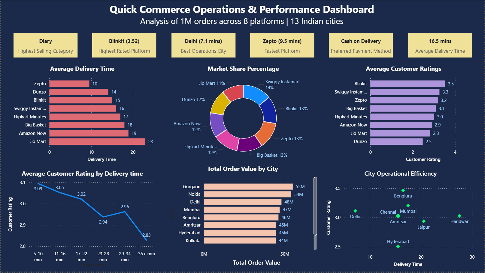

# Quick Commerce Operations & Performance Dashboard

An end-to-end data analysis project covering data exploration, cleaning, and business insight generation using **MySQL**, with a final interactive dashboard built in **Power BI**.

The dataset simulates ~1 million orders across 8 major quick commerce platforms (Blinkit, Zepto, Swiggy Instamart, Dunzo, JioMart, BigBasket, Amazon Now, Flipkart Minutes) and 13 Indian cities.

---



---

## Table of Contents

- [Project Overview](#project-overview)
- [Dataset](#dataset)
- [Tech Stack](#tech-stack)
- [Project Structure](#project-structure)
- [Part 1 — Data Exploration](#part-1---data-exploration)
- [Part 2 — Data Cleaning](#part-2---data-cleaning)
- [Part 3 — Business Insight Queries](#part-3---business-insight-queries)
- [Key Findings](#key-findings)
- [Power BI Dashboard](#power-bi-dashboard)
- [Data Limitation Note](#data-limitation-note)

---

## Project Overview

This project follows an **ELT (Extract, Load, Transform)** approach:

1. Raw CSV data was loaded directly into MySQL as TEXT columns
2. Data was explored to identify quality issues
3. A cleaned copy of the table was created with proper datatypes and imputed missing values
4. 12 business insight queries were written against the cleaned table
5. Query results were exported to Google Sheets and visualized in Power BI

---

## Dataset

- **Source:** [Kaggle — Quick Commerce Dataset by rohitgrewal](https://www.kaggle.com/datasets/rohitgrewal/quick-commerce-dataset)
- **Rows:** 947,752
- **Columns:** 13
- **Platforms covered:** Blinkit, Zepto, Swiggy Instamart, Dunzo, JioMart, BigBasket, Amazon Now, Flipkart Minutes
- **Cities covered:** 13 Indian cities including Delhi, Mumbai, Bengaluru, Hyderabad, Pune, Gurgaon, Noida, and others

---

## Tech Stack

- **MySQL 8.0** — Data exploration, cleaning, and analysis
- **Google Sheets** — Intermediate data storage and query result organization
- **Power BI Desktop** — Dashboard and visualization
- **GitHub** — Version control and portfolio hosting

---

## Project Structure

```
quick-commerce-ops-analysis/
│
├── sql/
│   └── quick_commerce_queries.sql   # All exploration, cleaning, and insight queries
│
├── dashboard.png                    # Power BI dashboard screenshot
├── quick_commerce.pbix              # Power BI dashboard file
└── README.md
```

---

## Part 1 - Data Exploration

**Database:** `quick_commerce` | **Table:** `qc_orders`

All columns were initially imported as TEXT using `LOAD DATA INFILE`. Exploration was done before any cleaning.

| Check | Finding |
|---|---|
| Total rows | 947,752 |
| Duplicate Order IDs | None |
| Missing — City | 52,000 rows |
| Missing — Customer_Rating | 47,000 rows |
| Missing — Items_Count | 35,000 rows |
| Hidden issue — Delivery_Partner_Rating | 104,137 rows contained ASCII 13 (carriage return `\r`) — not caught by standard NULL/blank checks, identified via `LENGTH()` check |
| Numeric MIN anomaly | MIN values returned as 0 due to blank strings being `CAST` to 0 — not actual data outliers |

**Key lesson from this phase:** A thorough exploration checklist should always include NULL check, LENGTH check, DISTINCT values check, and MIN/MAX/AVG check. Standard checks alone missed the `\r` issue affecting over 100,000 rows.

---

## Part 2 - Data Cleaning

A cleaned copy of the raw table was created first, leaving the original intact:

```sql
CREATE TABLE qc_orders_cleaned AS SELECT * FROM qc_orders;
```

### Missing Value Treatment

| Column | Issue | Treatment |
|---|---|---|
| City | Blank strings | Replaced with `'Unknown'` |
| Customer_Rating | Blank strings | Replaced with column average — `2.89` |
| Items_Count | Blank strings | Replaced with rounded column average — `10` |
| Delivery_Partner_Rating | `\r` carriage return values | Replaced with average excluding `\r` rows — `3.74` |

### Datatype Conversion

All columns were altered from TEXT to proper types after cleaning:

| Column | Type |
|---|---|
| Order_ID | VARCHAR(50) |
| Company | VARCHAR(50) |
| City | VARCHAR(50) |
| Customer_Age | INT |
| Order_Value | DECIMAL(10,2) |
| Delivery_Time_Min | DECIMAL(10,2) |
| Distance_KM | DECIMAL(10,2) |
| Items_Count | INT |
| Product_Category | VARCHAR(100) |
| Payment_Method | VARCHAR(50) |
| Customer_Rating | DECIMAL(10,2) |
| Discount_Applied | BOOLEAN |
| Delivery_Partner_Rating | DECIMAL(10,2) |

Note: `ALTER TABLE` produced 1,024 truncation warnings on a few columns — these were minor rounding differences only, no data loss.

---

## Part 3 - Business Insight Queries

12 queries written against `qc_orders_cleaned`, covering revenue, operations, customer behavior, and city-level performance.

### Q1 - Revenue by Product Category
All categories generated approximately ₹81–82M in revenue with an AOV of ₹571–573. Uniformity is expected given the synthetic nature of the dataset.

### Q2 - AOV by Customer Age Group
Age buckets: 18–23, 24–29, 30–35, 36–41, 42–47, 48–53, 54+. All groups returned ~₹571 AOV — consistent with synthetic data.

### Q3 - Revenue Market Share by Company
Used a subquery to calculate percentage share. Swiggy Instamart leads at 14.1%, JioMart trails at 10.5%. Slight variation across platforms is realistic.

### Q4 - Average Delivery Time by Company
Zepto is the fastest platform at **9.5 minutes** average delivery time. JioMart is the slowest at **22.9 minutes** — a 13+ minute gap that aligns well with real-world perceptions of these platforms.

### Q5 - Customer Rating by Company (Weighted by Order Volume)
Blinkit leads with a **3.52 average rating**. Dunzo trails at **2.47**. All companies processed ~124–125K orders, confirming uniform order distribution in the synthetic dataset.

### Q6 - Top 10 Cities by Order Value + Dominant Company
Used a correlated subquery with `LIMIT 1` to identify the dominant platform per city. Gurgaon leads with ₹54.9M total order value. Blinkit dominates in 5 of the top 10 cities. Top 3 cities: Delhi, Noida, Gurgaon.

### Q7 - Payment Method Preference
Cash on Delivery leads at 200,739 orders. All payment methods returned ~199–200K orders — uniform across the dataset.

### Q8 - Discount vs No Discount AOV
Discounted orders averaged **₹713 AOV** vs ₹477 for non-discounted orders. Important interpretation: this is **reverse causality** — higher-value orders are more likely to qualify for discounts. Discounts are not causing higher spending.

### Q9 - Delivery Time vs Customer Rating
Bucketed delivery times reveal a clear declining trend in customer satisfaction:

| Delivery Time Bucket | Avg Customer Rating |
|---|---|
| 5–10 min | 3.09 |
| 10–15 min | ~3.05 |
| 15–20 min | ~2.99 |
| 20–25 min | ~2.93 |
| 25–30 min | ~2.88 |
| 30–35 min | ~2.85 |
| 35+ min | 2.83 |

Cross-referenced with Q4 and Q5: Zepto is the fastest platform but not the highest rated — speed alone does not fully drive customer satisfaction.

### Q10 - Items Count vs Delivery Time and Partner Rating
Buckets: 1–5, 6–10, 11–15, 16–20 items. All buckets returned ~16.45 min delivery time and ~3.74 partner rating — uniform across order sizes.

### Q11 - Discount Rate vs Customer Rating by Company
All platforms discount at approximately 40% of orders. Blinkit and Dunzo have identical discount rates but vastly different customer ratings (3.52 vs 2.47). Discounting frequency does not drive customer satisfaction — service quality does.

### Q12 - City Operational Efficiency
The strongest query in the project. Key findings:

| City | Avg Delivery Time | Avg Customer Rating |
|---|---|---|
| Delhi | **7.1 min** (outlier — fastest) | — |
| Bengaluru | — | **3.46** (highest rated) |
| Hyderabad | — | **2.51** (lowest rated) |
| Haridwar | **27.5 min** (slowest) | — |

Delhi's 7.1 min average delivery time is a clear outlier relative to all other cities and stands out visually in the scatter plot.

---

## Key Findings

1. **Zepto is the fastest platform** at 9.5 min average delivery — 13+ minutes faster than JioMart (22.9 min)
2. **Faster delivery correlates with higher customer ratings**, but speed alone isn't everything — Zepto is fastest but Blinkit is highest rated
3. **Discounts don't drive higher spending** — higher-value orders qualify for discounts, not the other way around
4. **Discount frequency doesn't drive satisfaction** — Blinkit and Dunzo discount equally but have a 1-point rating gap
5. **Delhi is a significant operational outlier** at 7.1 min average delivery vs the ~16 min dataset average
6. **Bengaluru is the highest rated city** (3.46) despite not having the fastest delivery times
7. **Blinkit dominates geographically** — leads in 5 of the top 10 cities by order value and holds the highest customer rating

---

## Power BI Dashboard

The dashboard was built on a 1280×720 canvas with a dark navy (`#1B2A4A`) background.

**KPI Cards (top row):**
- Most Sold Category — Dairy
- Highest Rated Platform — Blinkit (3.52)
- Best Operations City — Delhi (7.1 mins)
- Fastest Platform — Zepto (9.5 mins)
- Preferred Payment — Cash on Delivery
- Average Delivery Time — 16.5 mins

**Charts:**
- Market Share % — Donut chart
- Avg Delivery Time by Platform — Horizontal bar (ascending, Zepto fastest)
- Avg Customer Rating by Platform — Horizontal bar (descending, Blinkit highest)
- Customer Rating vs Delivery Time — Line chart
- Total Order Value by City — Horizontal bar with dominant company in tooltip
- City Operational Efficiency — Scatter plot (Delhi outlier clearly visible)

---

## Data Limitation Note

This project uses a **synthetic dataset** from Kaggle that simulates quick commerce order data. Many columns (revenue by category, AOV by age group, payment method distribution, items count vs delivery time) return near-uniform results due to the synthetic generation method. Findings from queries showing variation — particularly Q3 (market share), Q4 (delivery time by platform), Q5 (customer ratings), Q9 (delivery time vs rating trend), and Q12 (city efficiency) — are the most analytically meaningful and closest to realistic patterns.
